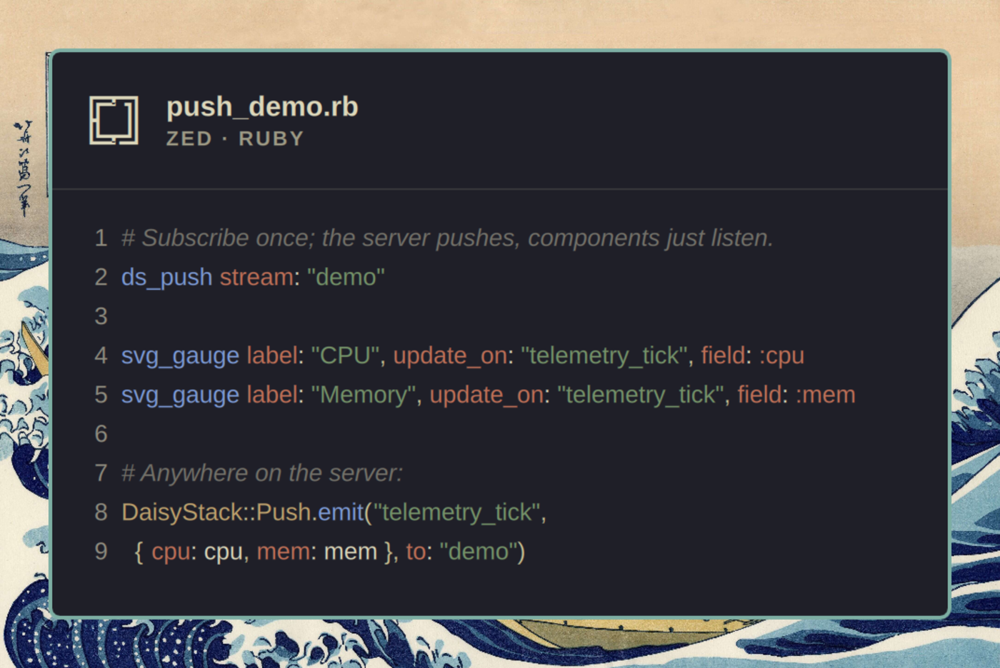
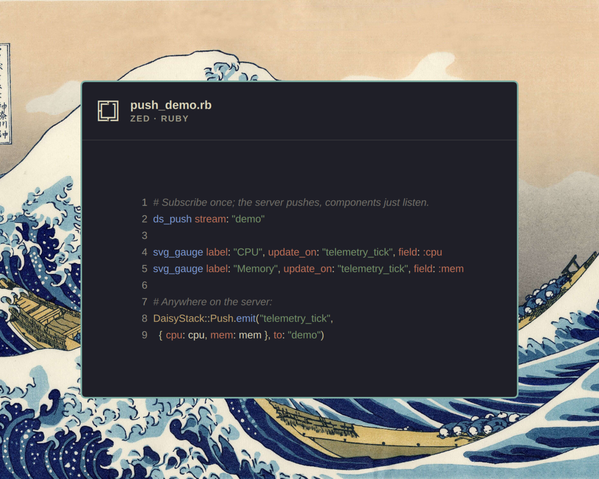
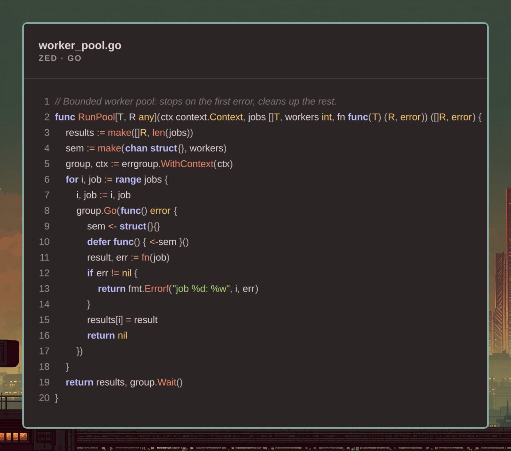
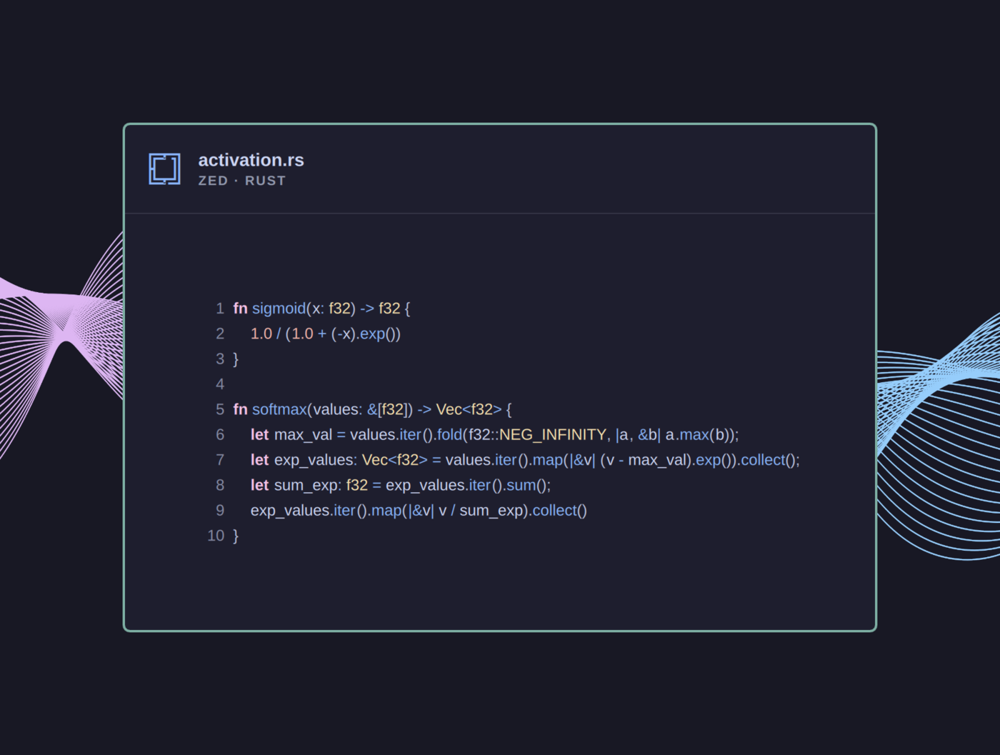
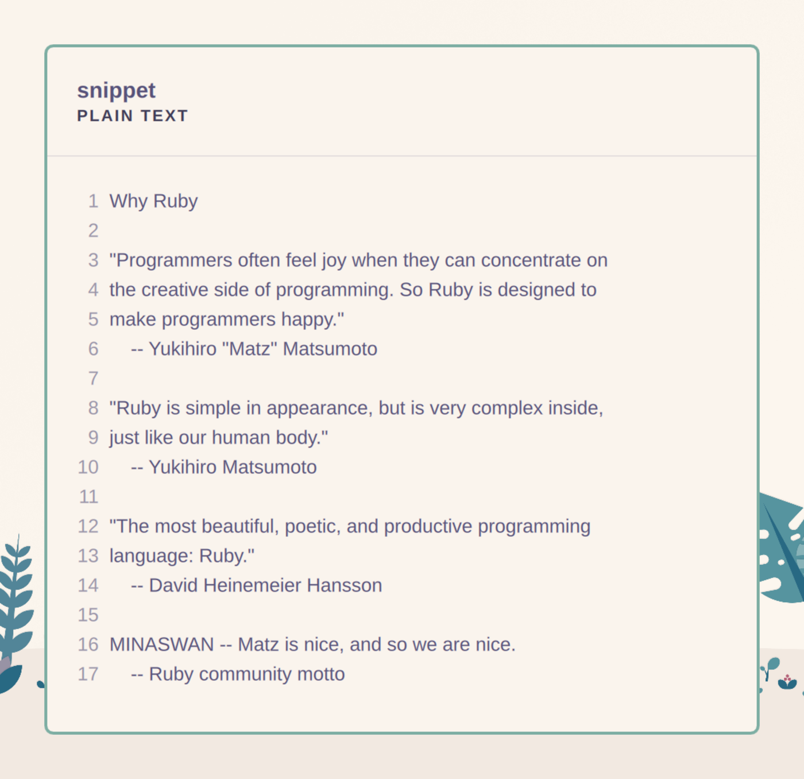
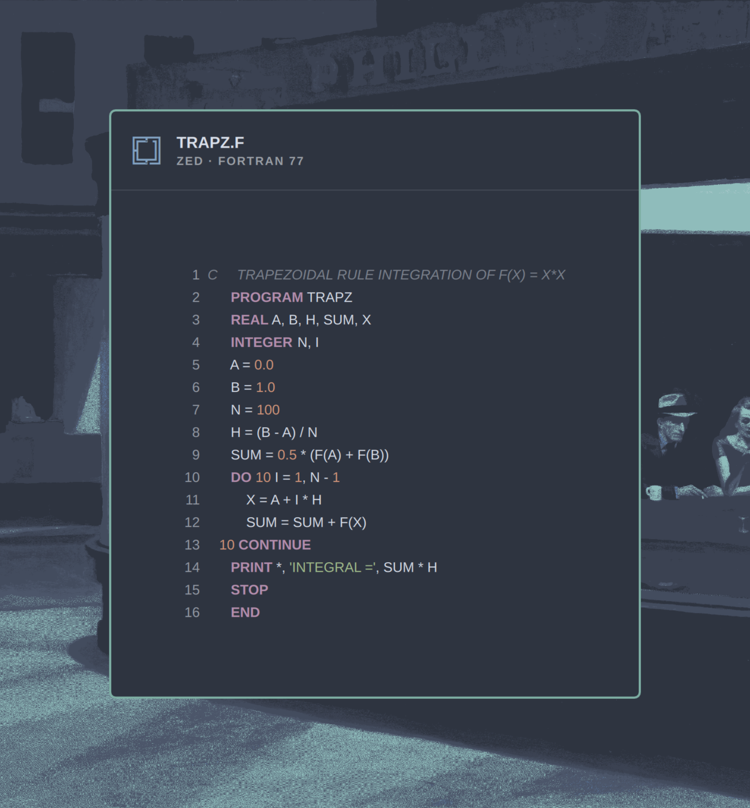
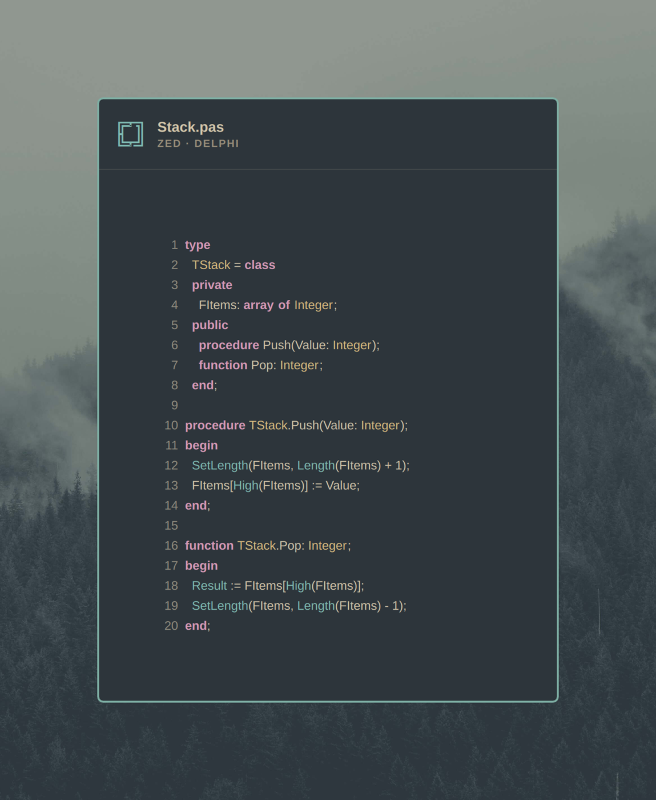
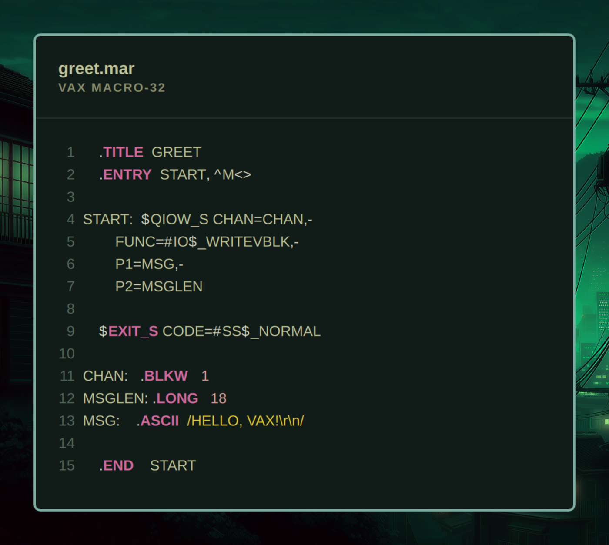
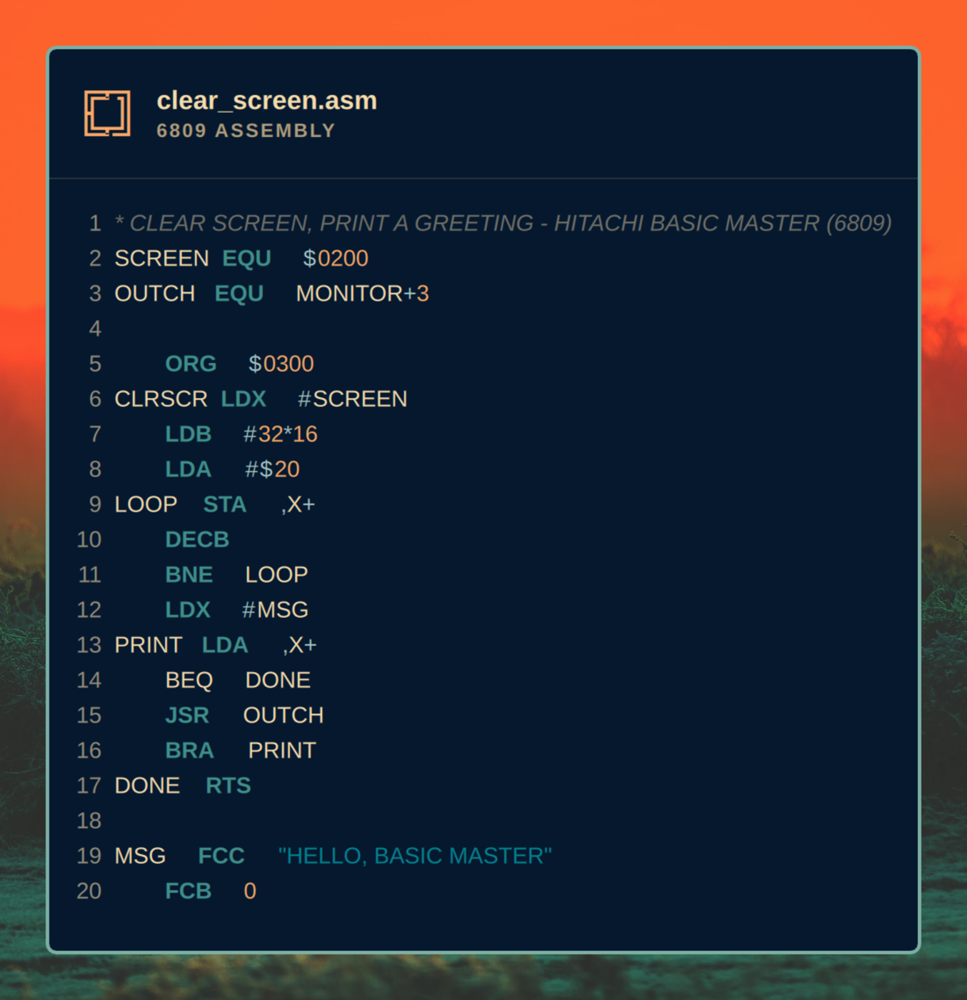

# Omasnap

**Status: beta (v0.9.0).** Working end to end and tested on real hardware,
but not yet submitted to [plugins.omarchy.org](https://plugins.omarchy.org)
— install it directly from this repo for now (below).

Select some code. Press a key. Get a gorgeous, unmistakably Omarchy image of
it — on the clipboard, ready to paste into a post, a doc, a chat. Like
codesnap.dev, but with the macOS traffic lights thrown out, wearing your
*actual* Omarchy theme, and coloured exactly the way your editor colours
that code right now — the same syntax highlighting, the same palette, down
to the pixel.

No editor plugin to install. No settings to configure. Select text anywhere
— Zed, a terminal, a browser — press the binding, and Omasnap reads the
current Omarchy theme and the focused window, frames the code like a
Hyprland tile (real border, real corners, the wallpaper behind it), and
hands you a PNG.



## Usage

Select some code in Zed (or anywhere else — see "Editors" below), press
**`SUPER + ALT + SHIFT + S`**. Within about a second a floating "Omasnap"
window appears, showing the selection framed exactly as the active editor
colours it, under the current Omarchy theme:

- **Enter** (or the **Copy** button) puts the rendered PNG on the clipboard
  (`image/png`) — paste it anywhere that accepts an image.
- **S** (or **Save**) writes it to `$(xdg-user-dir PICTURES)` (usually
  `~/Pictures`) as `omasnap-YYYY-MM-DD_HH-MM-SS.png`. Both actions leave the
  window open, so you can do both, or try a different language first.
- The language selector (bottom-left) shows what was detected from the
  filename or a `#!` shebang; pick a different one (or "plain", for no
  highlighting) to re-highlight without re-selecting anything.
- **Esc** (or **Close**) closes the window. Pressing the binding again while
  a preview is open doesn't close it — it replaces it with a fresh snap of
  whatever is selected then (or notifies "Nothing selected" if nothing is).

Selections over 200 lines are truncated (with a warning shown in the bar);
everything is read fresh from `wl-paste --primary` (falling back to the
clipboard) and the live Omarchy theme on every press — nothing is cached
between snaps.

## How it looks

The window reads as a Hyprland tile, not a floating card: a border the exact
width and colour of this desktop's `general:col.active_border`, corners
rounded to `decoration:rounding`, and margins sized off `general:gaps_out` —
all read live from `hyprctl` (falling back to Omarchy's own defaults off
Hyprland). No shadow unless this desktop draws one. The backdrop is the
current wallpaper at full sharpness, scaled to cover — no blur, no darkening
overlay. The header carries the Omarchy maze mark in the theme's accent
colour, the filename (or detected language) as the title, and the source and
language beneath it (`ZED · JAVASCRIPT`, `PLAIN TEXT`, …) — no wordmark or
logo anywhere.

### Editors

Zed is colour-exact: the same tree-sitter grammars and highlight queries
Zed itself uses, coloured from the Zed Omarchy theme. VS Code is colour-exact
too, a different way: the same TextMate tokenizer VS Code itself runs
(`vscode-textmate`/`vscode-oniguruma`), against a grammar read live off your
actual installed VS Code — its own built-in languages, or a marketplace
extension's, whichever provides one — coloured from **whichever theme VS
Code is actually showing right now** (`workbench.colorTheme`, resolved to
its real theme file — see `docs/adr/0006-vscode-active-theme.md`), not
from Omarchy's own bundled VS Code theme. If you run Gruvbox, Nord, or
anything else in VS Code instead of Omarchy's theme, that's what Omasnap
reproduces — the same "however the editor actually shows it" standard Zed
already gets, not a second, editor-agnostic colour scheme in disguise. A
language with no installed grammar (this is common for Rust and Go — see
`lib/vscode-extensions.mjs`, both colour purely via their language server,
with no static grammar to match) falls back to the generic highlighter
below.

Neovim is colour-exact a third way, and the simplest: since it runs inside
a terminal (no window of its own to detect), Omasnap finds it in the
terminal's process tree and asks the *live* Neovim itself — over the RPC
socket every Neovim instance already exposes — for its current visual
selection and the exact colours it's already rendering for it
(`vim.treesitter.get_captures_at_pos()` + `nvim_get_hl()`). No highlighter
of Omasnap's own runs at all, so it's automatically correct for whatever
colorscheme, plugins, or LSP semantic tokens you actually have configured.
This is also the one editor where Omasnap reads the selection itself from
the editor rather than the Wayland primary selection — see
`docs/adr/0007-neovim-rpc-highlighting.md` for why. No selection active in
Neovim (or Neovim isn't reachable) falls back to the primary selection like
every other editor.

Anywhere else — a terminal not running Neovim, a browser, another editor —
still snaps, highlighted generically, with the language detected from a
shebang line when there's no filename to go on.

Adding another editor means writing one file in `lib/editors/` (see
`lib/editors/registry.mjs` for the small adapter interface every one of
these implements) — not finding and extending several hardcoded if/else
chains.

## Gallery

Eight snippets, eight themes, every image produced by Omasnap itself — see
[`docs/gallery/SOURCES.md`](docs/gallery/SOURCES.md) for exactly where each
piece of code came from and how to reproduce a render.

| | |
|---|---|
|  A realtime push demo (Ruby, from DaisyStack) — **Kanagawa** |  A bounded worker pool (Go) — **Ristretto** |
|  `sigmoid`/`softmax` (Rust) — **Catppuccin** |  Quotes on why Ruby is beautiful — plain text, no editor — **Rosé Pine** |
|  Trapezoidal integration (**Fortran 77**) — Nord |  A stack class (**Delphi**) — Everforest |
|  A greeting routine (**VAX MACRO-32**, 1980s DEC minicomputer assembly) — Osaka Jade |  Clear-screen routine (**6809 assembly**, in the style of the Hitachi Basic Master) — Retro 82 |

The last four have no real Zed grammar behind them yet — see
[`docs/gallery/SOURCES.md`](docs/gallery/SOURCES.md) for how they're
coloured instead.

## Install on Omarchy

The quick way — Omarchy's own plugin manager fetches the repo for you:

```bash
omarchy plugin add https://github.com/keithrowell/omarchy-plugin-omasnap.git --enable
```

That's the whole install. `omarchy plugin add` (add `--yes` to skip its
confirmation prompt) clones this repo straight into
`~/.config/omarchy/plugins/com.keithrowell.omasnap`, validates it against
Omarchy's plugin schema, and enables it in the running shell — the "Enable
the shell plugin" step below is already done for you. The moment it's
enabled, `app/Service.qml` runs `bin/install` itself (there's no separate
step to remember — see `docs/adr/0004-service-runs-its-own-setup.md`): it
compiles the vendored Zed grammars (skip this and code still snaps, just in
plain text instead of real colours — the one part of this you'd actually
notice), adds an app-launcher entry, links `omasnap` onto your PATH, and
checks the required packages, silently — you'll only see a notification if
a real problem turned up (a missing package, a failed grammar build) or the
grammars just finished compiling for the first time. Update later with
`omarchy plugin update com.keithrowell.omasnap` (also self-sets-up on the
next load).

Developing on this repo instead? Keep a checkout elsewhere (a working
clone, or this repo as a submodule of your dotfiles the way the other
`com.keithrowell.*` plugins are) and let `bin/install` symlink it into
place — this path does *not* enable the shell plugin for you, see below:

```bash
git clone https://github.com/keithrowell/omarchy-plugin-omasnap.git
cd omarchy-plugin-omasnap
bin/install
```

Only needed once, for the symlink itself — `Service.qml` can't create it
(nothing's loaded at that path yet). After `omarchy plugin enable` below,
every later change here keeps itself set up the same way the marketplace
path does.

`bin/install` is idempotent (`--dry-run` shows what it would do without
touching anything; `--uninstall` reverses it; running it again reports
`unchanged`). It:

- links `~/.config/omarchy/plugins/com.keithrowell.omasnap` to this checkout,
  when nothing is already there;
- writes `~/.local/share/applications/Omasnap.desktop`, so the app launcher
  lists Omasnap;
- links `~/.local/bin/omasnap` to `bin/omasnap` when `~/.local/bin` exists,
  so the app can be started from a terminal;
- checks the required packages below are installed and reports any missing
  ones (it never fails the install over a missing package);
- compiles the vendored Zed-highlighting grammars (`bin/build-grammars`,
  below) and reports what it built, without failing the install if that
  step has a problem;
- prints, but never applies, the Hyprland binding below;
- reports whether the shell plugin (below) is already enabled.

## Enable the shell plugin

Already done if you installed with `omarchy plugin add --enable` above.
Otherwise — `bin/install` never does this for you, since it's a real
change to the running shell, not a file it can just write. One command,
once:

```bash
omarchy plugin enable com.keithrowell.omasnap
```

The binding below does nothing without it. If `omarchy plugin enable`
reports the plugin as unknown right after installing, run
`omarchy-shell shell rescanPlugins` first.

## Binding

`bin/install` prints this block for `~/.config/hypr/bindings.lua`; paste it
in by hand:

```lua
-- Omasnap: snap the selected code into an Omarchy-styled image.
o.bind("SUPER + ALT + SHIFT + S", "Omasnap", "~/.config/omarchy/plugins/com.keithrowell.omasnap/bin/omasnap")
o.window({ title = "^(Omasnap)$" }, { float = true, center = true })
```

## Uninstall

Installed with `omarchy plugin add`:

```bash
omarchy plugin remove com.keithrowell.omasnap
```

Installed from your own checkout with `bin/install`:

```bash
omarchy plugin disable com.keithrowell.omasnap   # stop the shell service
~/.config/omarchy/plugins/com.keithrowell.omasnap/bin/install --uninstall
```

`--uninstall` removes only what `bin/install` created and still points at
this checkout — the plugin symlink (if you installed by cloning straight
into the plugin directory), the app launcher entry, and the
`~/.local/bin/omasnap` launcher symlink — reporting anything it finds but
doesn't own as "left alone". It never touches your own checkout of this
repo; delete that yourself if you're removing Omasnap entirely. Either way,
remove the binding block above from `~/.config/hypr/bindings.lua` by hand.

## Required packages

```
sudo pacman -S --needed quickshell wl-clipboard qt6-5compat tree-sitter-cli gcc nodejs
```

`bin/install` reads this exact line and reports anything from it that is not
installed, with the command to install it.

## Zed-exact highlighting and the grammar build step

Zed's own highlighting rules — its tree-sitter grammars and `highlights.scm`
queries, at the versions Zed itself pins — are vendored under `vendor/`
rather than taken from pacman's `tree-sitter-grammars` packages, so the
colours are exactly Zed's regardless of what grammar versions Arch happens
to package. `bin/install` runs
`bin/build-grammars`, which compiles each `vendor/grammars/<name>/` source
tree into `vendor/grammars/lib/<name>.so` with the `tree-sitter` CLI
(idempotent — a second run reports `unchanged`; `bin/build-grammars --check`
reports what's missing without building). The first install compiles every
grammar, which takes well under a minute on a typical machine even for the
larger TypeScript/TSX grammars; later installs are near-instant. Re-run
`tools/vendor-grammars.sh` (network, dev-time only) to bump a grammar or
query pin.

**Supported languages:** JavaScript/JSX, TypeScript, TSX, Python, Rust, Go, C,
Bash, JSON(C), YAML, Markdown (block-level only — see below), Ruby, Lua.
Anything else falls back to one plain span per line in the theme's editor
foreground, never an error. Markdown is highlighted with Zed's own *block*
grammar only: headings, list markers and fenced-code delimiters colour; a
fenced code block's contents and inline emphasis (no injections in this
build) render as plain text. Zed's semantic (LSP) highlighting, layered on
top of tree-sitter in the real editor, is not reproduced.

## Where the colours come from

Every colour comes from `~/.local/state/omarchy/current/theme/`:
`colors.toml` for the frame and chrome, `zed-theme.json` for Zed's syntax
colours, `vscode-theme.json` for VS Code's. The theme is read fresh on every
snap, so switching the Omarchy theme changes the very next image with no
restart. Nothing is ever hard-coded.

**No stock Omarchy theme ships a `zed-theme.json`** — only a handful of
hand-authored community themes do (see
[`docs/gallery/SOURCES.md`](docs/gallery/SOURCES.md) for which ones).
Rather than falling back to flat, uncoloured text for everyone else,
`readTheme()` synthesizes a reasonable one from `colors.toml`
(`synthesizeZedTheme` in `lib/theme.mjs`) — the same generic
capture-to-colour mapping (keywords, strings, comments, types, …) a
personal Omarchy hook can render for real Zed integration, computed here so
every install looks colourful, not only ones with that customisation. A
theme's own `zed-theme.json`, when it has one, always wins.

## Non-goals

- No editor plugins or extensions — Omasnap never asks Zed or VS Code to do anything.
- No non-Omarchy styling: no theme picker, no macOS/Windows chrome, no arbitrary colour schemes.
- No direct posting to social networks; it produces an image, sharing is yours.
- No editing or annotation UI: no arrows, highlights, or captions on the image.

## Development

```bash
bin/omasnap                        # run from the checkout: snap the current selection and preview it
bin/omasnap --benchmark            # time the non-window steps of a live snap (no window opens)
node --test tests/*.test.mjs       # every test in the project
bin/build-grammars                 # compile vendored grammars (first run only; node --test does this too)
bin/build-grammars --check         # report what's missing/stale without building
```

`bin/omasnap --fixture` (headless) always runs fresh QML — but the live
binding talks over IPC to the Omarchy shell process, which loads
`app/Service.qml`/`app/Overlay.qml`/`app/Snap.qml` once and (on this build)
never re-reads them: the shell runs with `QS_DISABLE_FILE_WATCHER=1`, so it
does not hot-reload, and `omarchy plugin disable`/`enable` does not force a
reload either (same process, same stale code). After changing anything
under `app/`, run `omarchy-restart-shell` before testing the live binding —
skipping this makes a real fix look unfixed.

`bin/omasnap --fixture F --out P` renders a fixture (a JSON file shaped like
`tests/fixtures/render/*.json`: filename, language, editor, font and
highlighted lines) straight to a PNG, headlessly, with no selection or editor
involved — the same frame (`app/Snap.qml`) the real snap window uses, so it's
how builders and reviewers check the look without a live selection. It reads
the current Omarchy theme by default; `--theme-dir` and `--wallpaper`
override which theme and wallpaper it renders against, for comparing themes
side by side.

`OMASNAP_AUTO=copy|save|shot|none bin/omasnap` drives the live preview
window unattended (used to test Copy/Save without a human, or to grab a
picture of the bar itself with `shot`) — the same environment variable
Pacman's `PACMAN_DEBUG_KEYS` plays a similar role for.

`docs/agentile/` and `docs/adr/` carry the backlog and the decision records
this project is built from (see `CLAUDE.md`).

## Contributing

Bug reports, feature requests, and pull requests are welcome — see
[CONTRIBUTING.md](CONTRIBUTING.md) for the development loop and ground
rules, and [CODE_OF_CONDUCT.md](CODE_OF_CONDUCT.md) for how we expect
people to treat each other here.

## Licence

MIT (see `LICENSE`).
