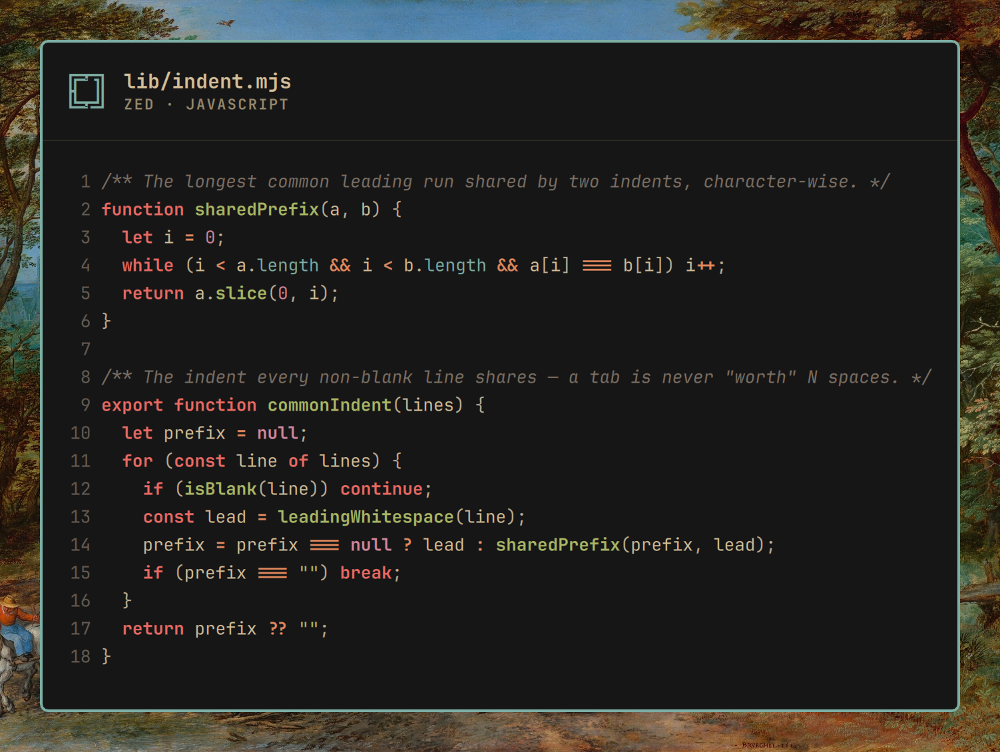

# Omasnap

Share code snaps in Omarchy style with ease.



Select something, press a key, and a PNG like the one above lands on your
clipboard and in `~/Pictures`. The frame is your Omarchy theme and your
wallpaper. No traffic lights, no logo.

You can snap text from anywhere: a terminal, a browser, a chat. If it's
code, it gets syntax highlighting in the theme's colours. If you snap it
from a supported editor, it's coloured exactly the way that editor is
showing it right now, down to the pixel.

## Supported editors

- **Zed**
- **VS Code** (and VSCodium, Cursor)
- **Neovim**

Anything else still snaps, highlighted generically, with the language
picked up from the filename or a `#!` line. Highlighted languages:
JavaScript, TypeScript, TSX, Python, Rust, Go, C, Bash, JSON, YAML,
Markdown, Ruby, Lua. Everything else renders as plain text.

## Beta

Omasnap is in beta. It works end to end on real hardware, but it has had
one desk's worth of testing. If you use Omarchy and post code, please try
it and [report what breaks](https://github.com/keithrowell/omarchy-plugin-omasnap/issues).

Want your editor supported? Adding one is a single file under
`lib/editors/` — see [CONTRIBUTING.md](CONTRIBUTING.md). Pull requests
welcome; so are issues that just say which editor.

## Install

```bash
omarchy plugin add https://github.com/keithrowell/omarchy-plugin-omasnap.git --enable
```

That's the install. The plugin sets itself up the first time the shell
loads it: it compiles the Zed grammars, adds an app launcher entry, and
checks the packages it needs. You'll only hear about it if something is
missing.

Then add the binding to `~/.config/hypr/bindings.lua`:

```lua
-- Omasnap: snap the selected code into an Omarchy-styled image.
o.bind("SUPER + ALT + SHIFT + S", "Omasnap", "~/.config/omarchy/plugins/com.keithrowell.omasnap/bin/omasnap")
o.window({ title = "^(Omasnap)$" }, { float = true, center = true })
```

Update with `omarchy plugin update com.keithrowell.omasnap`. Remove with
`omarchy plugin remove com.keithrowell.omasnap` and delete the binding.

It needs these packages, most of which Omarchy already ships. The
installer checks this exact line and tells you if anything is missing:

```
sudo pacman -S --needed quickshell wl-clipboard qt6-5compat tree-sitter-cli gcc nodejs
```

## Using it

Select some code and press **SUPER + ALT + SHIFT + S**. A preview window
appears in about a second.

- **Enter** or **Copy** puts the PNG on the clipboard.
- **S** or **Save** writes it to `~/Pictures` as `omasnap-<date>_<time>.png`.
- The language button bottom-left shows what was detected. Click it, or
  press **Left**/**Right**, to pick another language or plain text. The
  image redraws.
- **Esc** or **Close** closes it. Pressing the binding again replaces the
  preview with a fresh snap.

Selections are capped at 200 lines. Each snap reads the theme fresh, so
switching Omarchy themes changes the next image with no restart.

## How it works with editors

Omasnap never installs anything into your editor. It reads the Wayland
primary selection (what you've highlighted) and asks Hyprland which window
is focused. From there it depends on the editor.

**Zed.** Omasnap ships the same tree-sitter grammars and highlight queries
Zed uses, pinned to the versions Zed pins, and colours the result from the
Omarchy theme's Zed colours. Most Omarchy themes don't ship a Zed theme
file, so Omasnap builds one from the theme's `colors.toml`.

**VS Code.** Omasnap runs the same TextMate tokenizer VS Code does, using
the grammar from your installed VS Code (built in or from an extension),
and colours it from whatever theme VS Code is actually showing. If you run
Nord in VS Code, your snap is Nord. Languages with no static grammar, such
as Rust and Go, fall back to the generic highlighting.

**Neovim.** Neovim lives in a terminal, so Omasnap finds it in the
terminal's process tree and asks the running Neovim, over its RPC socket,
for the current visual selection and the colours it's drawing. Nothing is
re-highlighted, so plugins, colorschemes and LSP tokens all come through.
This is the one editor where Omasnap takes the selection from the editor
rather than from Wayland.

**Everything else.** The text is highlighted with Omasnap's own Zed
grammars in the theme's colours, or left plain if the language isn't
recognised.

Every colour comes from `~/.local/state/omarchy/current/theme/`. Nothing is
hard-coded. The window frame copies your Hyprland border width, colour and
corner radius, read live from `hyprctl`.

## Gallery

Eight snippets, eight themes, every image made by Omasnap. See
[`docs/gallery/SOURCES.md`](docs/gallery/SOURCES.md) for where each piece
of code came from and how to reproduce a render.

| | |
|---|---|
|  A realtime push demo (Ruby, from DaisyStack) — **Kanagawa** |  A bounded worker pool (Go) — **Ristretto** |
|  `sigmoid`/`softmax` (Rust) — **Catppuccin** |  Quotes on why Ruby is beautiful — plain text, no editor — **Rosé Pine** |
|  Trapezoidal integration (**Fortran 77**) — Nord |  A stack class (**Delphi**) — Everforest |
|  A greeting routine (**VAX MACRO-32**, 1980s DEC minicomputer assembly) — Osaka Jade |  Clear-screen routine (**6809 assembly**, in the style of the Hitachi Basic Master) — Retro 82 |

The last four have no Zed grammar behind them; `SOURCES.md` explains how
they were coloured.

## Contributing

Bug reports, feature requests and pull requests are welcome. See
[CONTRIBUTING.md](CONTRIBUTING.md) for the development loop and
[CODE_OF_CONDUCT.md](CODE_OF_CONDUCT.md) for how we treat each other.
The current version is the `version` field in
[`manifest.json`](manifest.json), tagged `v<version>` in git.

## Licence

MIT (see `LICENSE`).
