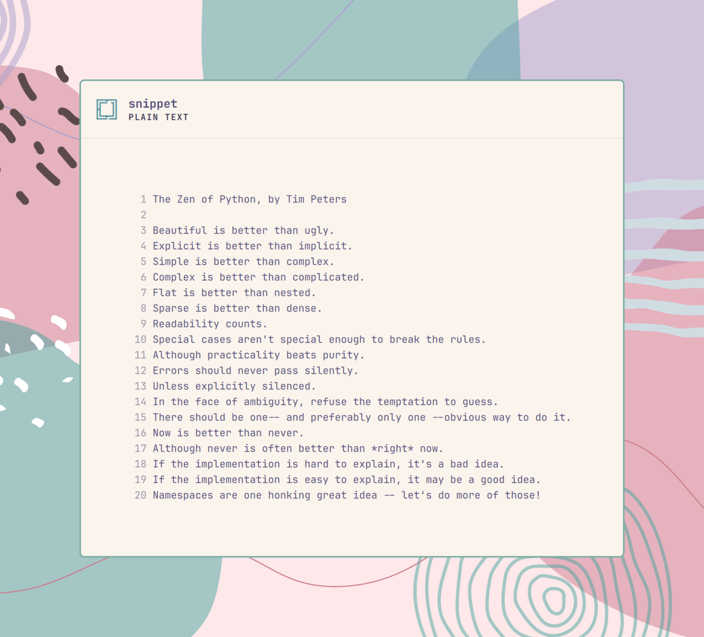

# Omasnap

**Status: beta (v0.9.0).** Working end to end and tested on real hardware,
but not yet submitted to [plugins.omarchy.org](https://plugins.omarchy.org)
— install it directly from this repo for now (below).

Select some code. Press a key. Get a gorgeous, unmistakably Omarchy image of
it — on the clipboard, ready to paste into a post, a doc, a chat. Like
codesnap.dev, but with the macOS traffic lights thrown out, wearing your
*actual* Omarchy theme, and coloured exactly the way your editor colours
that code right now — the same syntax highlighting, the same palette, down
to the pixel.

No editor plugin to install. No settings to configure. Select text anywhere
— Zed, a terminal, a browser — press the binding, and Omasnap reads the
current Omarchy theme and the focused window, frames the code like a
Hyprland tile (real border, real corners, the wallpaper behind it), and
hands you a PNG.


## Usage

Select some code in Zed (or anywhere else — see "Editors" below), press
**`SUPER + ALT + SHIFT + S`**. Within about a second a floating "Omasnap"
window appears, showing the selection framed exactly as the active editor
colours it, under the current Omarchy theme:

- **Enter** (or the **Copy** button) puts the rendered PNG on the clipboard
  (`image/png`) — paste it anywhere that accepts an image.
- **S** (or **Save**) writes it to `$(xdg-user-dir PICTURES)` (usually
  `~/Pictures`) as `omasnap-YYYY-MM-DD_HH-MM-SS.png`. Both actions leave the
  window open, so you can do both, or try a different language first.
- The language selector (bottom-left) shows what was detected from the
  filename or a `#!` shebang; pick a different one (or "plain", for no
  highlighting) to re-highlight without re-selecting anything.
- **Esc** (or **Close**) closes the window. Pressing the binding again while
  a preview is open doesn't close it — it replaces it with a fresh snap of
  whatever is selected then (or notifies "Nothing selected" if nothing is).

Selections over 200 lines are truncated (with a warning shown in the bar);
everything is read fresh from `wl-paste --primary` (falling back to the
clipboard) and the live Omarchy theme on every press — nothing is cached
between snaps.

## How it looks

The window reads as a Hyprland tile, not a floating card: a border the exact
width and colour of this desktop's `general:col.active_border`, corners
rounded to `decoration:rounding`, and margins sized off `general:gaps_out` —
all read live from `hyprctl` (falling back to Omarchy's own defaults off
Hyprland). No shadow unless this desktop draws one. The backdrop is the
current wallpaper at full sharpness, scaled to cover — no blur, no darkening
overlay. The header carries the Omarchy maze mark in the theme's accent
colour, the filename (or detected language) as the title, and the source and
language beneath it (`ZED · JAVASCRIPT`, `PLAIN TEXT`, …) — no wordmark or
logo anywhere.

### Editors

Zed is colour-exact: the same tree-sitter grammars and highlight queries
Zed itself uses, coloured from the Zed Omarchy theme. Anywhere else — a
terminal, a browser, another editor — still snaps, highlighted the same
way, with the language detected from a shebang line when there's no
filename to go on. VS Code's own exact colouring (its `tokenColors`) is
next, and not yet started — if you use VS Code, a PR would be very welcome.

## Gallery

Eight snippets, eight themes, every image produced by Omasnap itself — see
[`docs/gallery/SOURCES.md`](docs/gallery/SOURCES.md) for exactly where each
piece of code came from and how to reproduce a render.

| | |
|---|---|
|  A realtime push demo (Ruby, from DaisyStack) — **Kanagawa** |  A bounded worker pool (Go) — **Ristretto** |
|  `sigmoid`/`softmax` (Rust) — **Catppuccin** |  *The Zen of Python* — plain text, no editor — **Rosé Pine** |
|  Trapezoidal integration (**Fortran 77**) — Nord |  A stack class (**Delphi**) — Everforest |
|  A greeting routine (**VAX MACRO-32**, 1980s DEC minicomputer assembly) — Osaka Jade |  Clear-screen routine (**6809 assembly**, in the style of the Hitachi Basic Master) — Retro 82 |

The last four have no real Zed grammar behind them yet — see
[`docs/gallery/SOURCES.md`](docs/gallery/SOURCES.md) for how they're
coloured instead.

## Install on Omarchy

Either clone this repo straight into the plugin directory:

```bash
git clone https://github.com/keithrowell/omarchy-plugin-omasnap.git ~/.config/omarchy/plugins/com.keithrowell.omasnap
~/.config/omarchy/plugins/com.keithrowell.omasnap/bin/install
```

or keep a checkout elsewhere (a development clone, or this repo as a
submodule of the dotfiles the way the other `com.keithrowell.*` plugins are)
and let `bin/install` symlink it into place:

```bash
bin/install
```

`bin/install` is idempotent (`--dry-run` shows what it would do without
touching anything; `--uninstall` reverses it; running it again reports
`unchanged`). It:

- links `~/.config/omarchy/plugins/com.keithrowell.omasnap` to this checkout,
  when nothing is already there;
- writes `~/.local/share/applications/Omasnap.desktop`, so the app launcher
  lists Omasnap;
- links `~/.local/bin/omasnap` to `bin/omasnap` when `~/.local/bin` exists,
  so the app can be started from a terminal;
- checks the required packages below are installed and reports any missing
  ones (it never fails the install over a missing package);
- compiles the vendored Zed-highlighting grammars (`bin/build-grammars`,
  below) and reports what it built, without failing the install if that
  step has a problem;
- prints, but never applies, the Hyprland binding below;
- reports whether the shell plugin (below) is already enabled.

## Enable the shell plugin

`bin/install` never does this for you — it's a real change to the running
shell, unlike the files above. One command, once:

```bash
omarchy plugin enable com.keithrowell.omasnap
```

The binding below does nothing without it. If `omarchy plugin enable`
reports the plugin as unknown right after installing, run
`omarchy-shell shell rescanPlugins` first.

## Binding

`bin/install` prints this block for `~/.config/hypr/bindings.lua`; paste it
in by hand:

```lua
-- Omasnap: snap the selected code into an Omarchy-styled image.
o.bind("SUPER + ALT + SHIFT + S", "Omasnap", "~/.config/omarchy/plugins/com.keithrowell.omasnap/bin/omasnap")
o.window({ title = "^(Omasnap)$" }, { float = true, center = true })
```

## Uninstall

```bash
omarchy plugin disable com.keithrowell.omasnap   # stop the shell service
~/.config/omarchy/plugins/com.keithrowell.omasnap/bin/install --uninstall
```

`--uninstall` removes only what `bin/install` created and still points at
this checkout — the plugin symlink (if you installed by cloning straight
into the plugin directory), the app launcher entry, and the
`~/.local/bin/omasnap` launcher symlink — reporting anything it finds but
doesn't own as "left alone". It never touches your own checkout of this
repo; delete that yourself if you're removing Omasnap entirely. Then remove
the binding block above from `~/.config/hypr/bindings.lua` by hand.

## Required packages

```
sudo pacman -S --needed quickshell wl-clipboard qt6-5compat tree-sitter-cli gcc nodejs
```

`bin/install` reads this exact line and reports anything from it that is not
installed, with the command to install it.

## Zed-exact highlighting and the grammar build step

Zed's own highlighting rules — its tree-sitter grammars and `highlights.scm`
queries, at the versions Zed itself pins — are vendored under `vendor/`
rather than taken from pacman's `tree-sitter-grammars` packages, so the
colours are exactly Zed's regardless of what grammar versions Arch happens
to package. `bin/install` runs
`bin/build-grammars`, which compiles each `vendor/grammars/<name>/` source
tree into `vendor/grammars/lib/<name>.so` with the `tree-sitter` CLI
(idempotent — a second run reports `unchanged`; `bin/build-grammars --check`
reports what's missing without building). The first install compiles every
grammar, which takes well under a minute on a typical machine even for the
larger TypeScript/TSX grammars; later installs are near-instant. Re-run
`tools/vendor-grammars.sh` (network, dev-time only) to bump a grammar or
query pin.

**Supported languages:** JavaScript/JSX, TypeScript, TSX, Python, Rust, Go, C,
Bash, JSON(C), YAML, Markdown (block-level only — see below), Ruby, Lua.
Anything else falls back to one plain span per line in the theme's editor
foreground, never an error. Markdown is highlighted with Zed's own *block*
grammar only: headings, list markers and fenced-code delimiters colour; a
fenced code block's contents and inline emphasis (no injections in this
build) render as plain text. Zed's semantic (LSP) highlighting, layered on
top of tree-sitter in the real editor, is not reproduced.

## Where the colours come from

Every colour comes from `~/.local/state/omarchy/current/theme/`:
`colors.toml` for the frame and chrome, `zed-theme.json` for Zed's syntax
colours, `vscode-theme.json` for VS Code's. The theme is read fresh on every
snap, so switching the Omarchy theme changes the very next image with no
restart. Nothing is ever hard-coded.

**No stock Omarchy theme ships a `zed-theme.json`** — only a handful of
hand-authored community themes do (see
[`docs/gallery/SOURCES.md`](docs/gallery/SOURCES.md) for which ones).
Rather than falling back to flat, uncoloured text for everyone else,
`readTheme()` synthesizes a reasonable one from `colors.toml`
(`synthesizeZedTheme` in `lib/theme.mjs`) — the same generic
capture-to-colour mapping (keywords, strings, comments, types, …) a
personal Omarchy hook can render for real Zed integration, computed here so
every install looks colourful, not only ones with that customisation. A
theme's own `zed-theme.json`, when it has one, always wins.

## Non-goals

- No editor plugins or extensions — Omasnap never asks Zed or VS Code to do anything.
- No non-Omarchy styling: no theme picker, no macOS/Windows chrome, no arbitrary colour schemes.
- No direct posting to social networks; it produces an image, sharing is yours.
- No editing or annotation UI: no arrows, highlights, or captions on the image.

## Development

```bash
bin/omasnap                        # run from the checkout: snap the current selection and preview it
bin/omasnap --benchmark            # time the non-window steps of a live snap (no window opens)
node --test tests/*.test.mjs       # every test in the project
bin/build-grammars                 # compile vendored grammars (first run only; node --test does this too)
bin/build-grammars --check         # report what's missing/stale without building
```

`bin/omasnap --fixture F --out P` renders a fixture (a JSON file shaped like
`tests/fixtures/render/*.json`: filename, language, editor, font and
highlighted lines) straight to a PNG, headlessly, with no selection or editor
involved — the same frame (`app/Snap.qml`) the real snap window uses, so it's
how builders and reviewers check the look without a live selection. It reads
the current Omarchy theme by default; `--theme-dir` and `--wallpaper`
override which theme and wallpaper it renders against, for comparing themes
side by side.

`OMASNAP_AUTO=copy|save|shot|none bin/omasnap` drives the live preview
window unattended (used to test Copy/Save without a human, or to grab a
picture of the bar itself with `shot`) — the same environment variable
Pacman's `PACMAN_DEBUG_KEYS` plays a similar role for.

`docs/agentile/` and `docs/adr/` carry the backlog and the decision records
this project is built from (see `CLAUDE.md`).

## Licence

MIT (see `LICENSE`).
